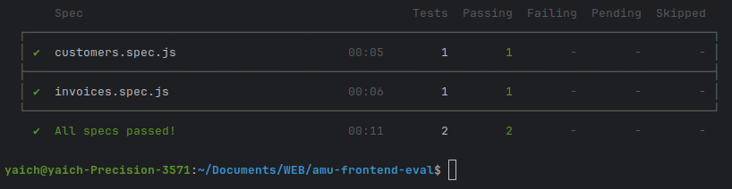

# Tests cypress : 




# Lancement de l'application : 

```bash
# télécharger votre projet :
git clone https://github.com/Hamza9696/FrontEndEval.git

# entrer dans le dossier
cd FrontEndEval

# télécharger les dépendances 
npm install @angular/router @angular/material

# lancer l'application :
npm run start

# lancer les tests :
npm run cy:run
# ou
npm run cy:open
```
